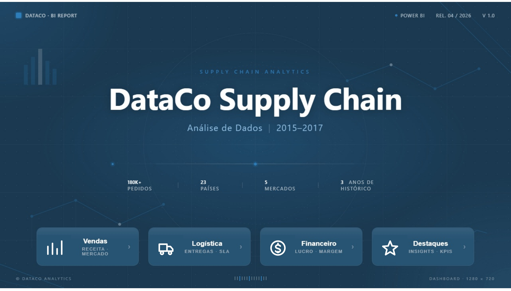
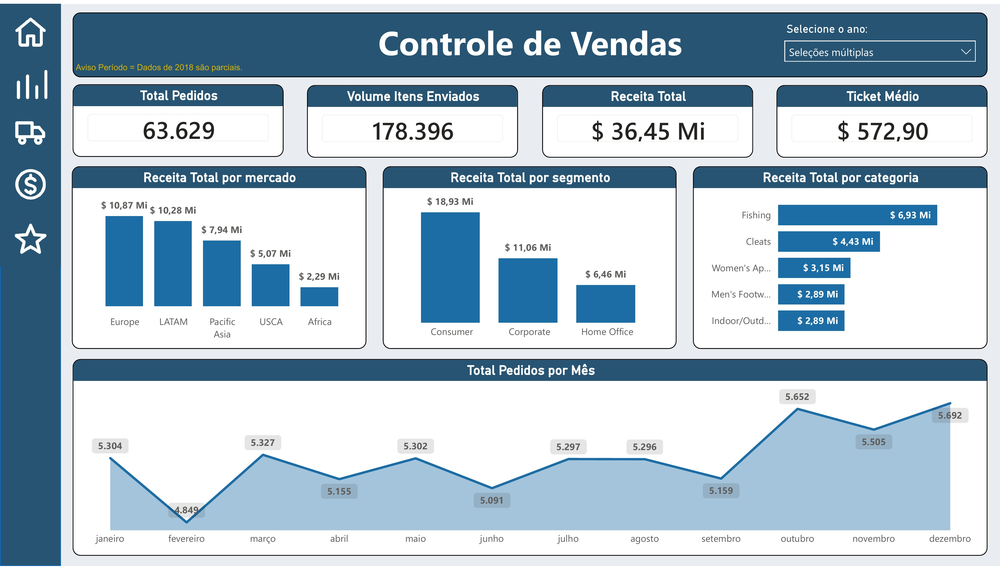
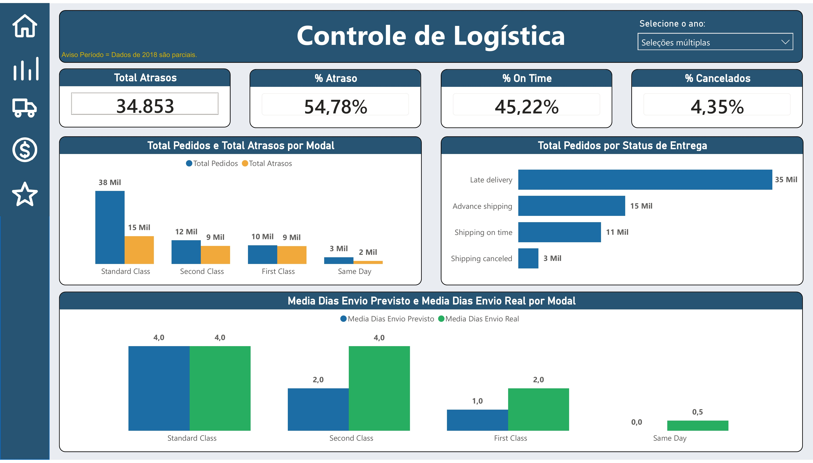
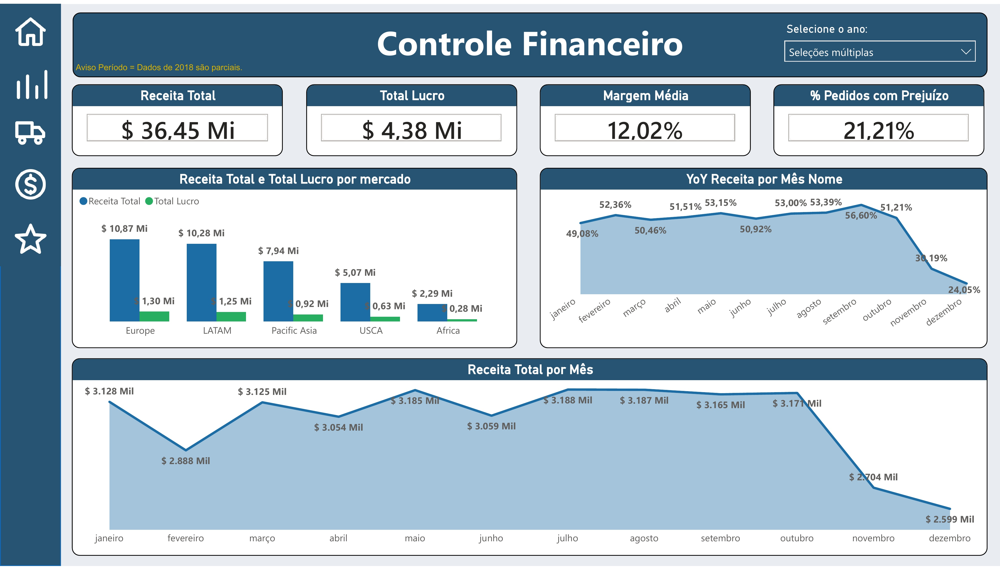
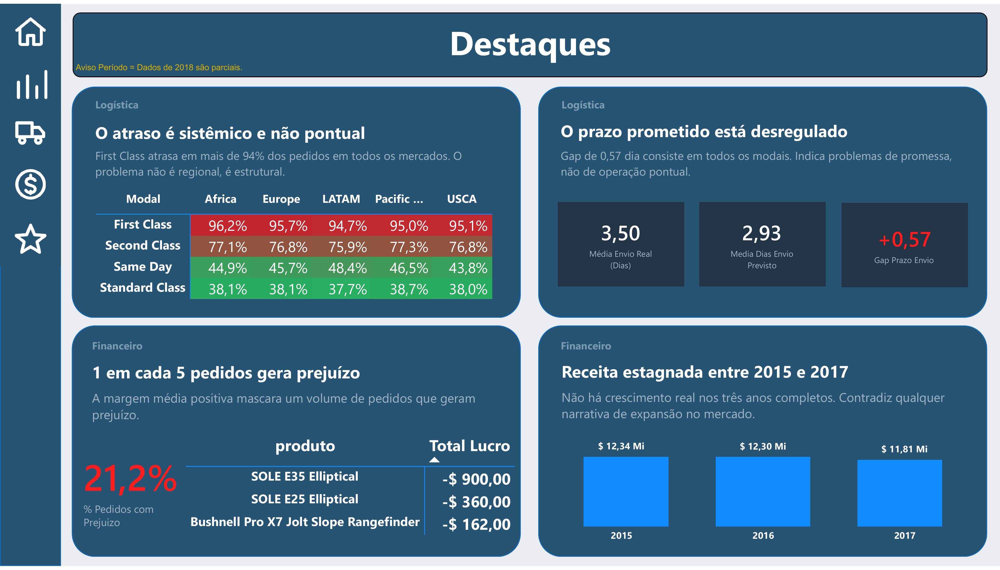

# DataCo Supply Chain: Análise de Dados com SQL Server e Power BI

Dashboard interativo em Power BI com análise de 65 mil pedidos de uma empresa global de e-commerce. Projeto completo: modelagem em SQL Server, views analíticas, medidas DAX e storytelling com dados.

---

## Sobre o projeto

O DataCo Supply Chain é um dataset público do Kaggle com 180 mil itens de pedidos, cobrindo vendas, logística e finanças de uma empresa fictícia de e-commerce entre 2015 e 2017.

O objetivo foi construir um pipeline analítico completo, da ingestão dos dados brutos em SQL Server até um dashboard interativo em Power BI, simulando o trabalho de um analista de dados em ambiente corporativo.

---

## Stack

- SQL Server 2017+ e SSMS
- Power BI Desktop (DAX + tabela calendário)
- Python (script auxiliar de importação)

---

## Estrutura do repositório

```
dataco-supply-chain-analysis/
├── sql/
│   ├── 01_criar_banco.sql
│   ├── 02_importar_dados.sql
│   ├── 03_vw_vendas.sql
│   └── 04_vw_acessos.sql
├── docs/
│   ├── DataCO_Capa.jpg
│   ├── DataCO_Vendas.jpg
│   ├── DataCO_Logistica.jpg
│   ├── DataCO_Financeiro.jpg
│   └── DataCO_Destaques.jpg
└── powerbi/
    └── DataCO - Dashboards.pbix
```

---

## Dashboard

O dashboard é composto por 5 páginas com navegação interativa.

**Capa**



**Controle de Vendas**



Receita total, ticket médio, sazonalidade e top categorias por receita.

**Controle de Logística**



Atraso por modal, prazo prometido vs real e status de entrega.

**Controle Financeiro**



Margem, lucro total e variação YoY de receita e lucro.

**Destaques**



4 insights de negócio com narrativa baseada nos dados.

---

## Principais descobertas

1. First Class atrasa em 95% dos pedidos em todos os mercados. O problema não é operacional, é de SLA mal calibrado.
2. Gap médio de 0,57 dia entre prazo prometido (2,93 dias) e prazo real (3,50 dias).
3. 1 em cada 5 pedidos gera prejuízo líquido. A margem média positiva mascara o problema.
4. Receita estagnada entre 2015 e 2017, de $12,34M para $11,81M, sem crescimento real.

---

## Dataset

Fonte: [DataCo Smart Supply Chain (Kaggle)](https://www.kaggle.com/datasets/shashwatwork/dataco-smart-supply-chain-for-big-data-analysis)

180.519 itens | 65.752 pedidos únicos | 24 países | 5 mercados | Jan/2015 a Dez/2017

Os arquivos CSV não estão incluídos no repositório por conta do tamanho. Faça o download diretamente pelo link acima.

---

## Autor

Leonardo Guerrera

[LinkedIn](https://www.linkedin.com/in/leonardo-guerrera/) | [GitHub](https://github.com/leoguerrera)
